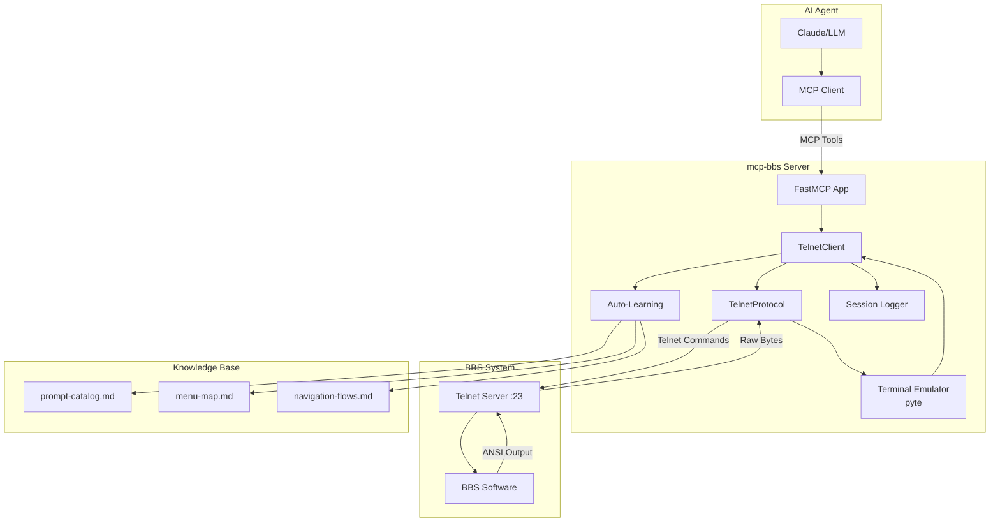

# mcp-bbs

FastMCP-based telnet client for BBS (Bulletin Board System) interactions with auto-learning capabilities. Enables AI agents to interact with legacy telnet-based systems through the Model Context Protocol (MCP).

> **⚠️ AI-Generated Code Disclaimer**
>
> This project was generated using AI assistance. While functional, it may contain bugs, security vulnerabilities, or unexpected behavior. Use at your own risk. The author assumes no responsibility or liability for any issues, damages, or losses resulting from the use of this software. Review the code thoroughly before using in any production environment.

## Overview

mcp-bbs bridges modern AI agents with vintage BBS systems by providing:
- Full terminal emulation with ANSI/CP437 support
- Pattern-based screen reading and navigation
- Automatic discovery and documentation of menus and prompts
- Session logging for analysis and replay
- MCP tool exposure for seamless AI integration

## Architecture



## Features

- **Telnet Client**: Full RFC 854 telnet protocol with option negotiation (BINARY, SGA, NAWS, TTYPE)
- **Terminal Emulation**: Complete ANSI/CP437 terminal with 80x25 (configurable) screen buffer
- **Screen Reading**: Extract text, match patterns, wait for prompts with timeout control
- **Auto-Learning**: Discover menus `[A] Option`, prompts `Enter name:`, and document navigation flows
- **Session Logging**: JSONL format with timestamps, context, and raw bytes for replay/analysis
- **MCP Integration**: 25+ tools for connection, navigation, learning, and session management
- **Keepalive**: Configurable interval to prevent idle disconnections

## Installation

### Prerequisites

Install [uv](https://docs.astral.sh/uv/) (recommended package installer):

```bash
curl -LsSf https://astral.sh/uv/install.sh | sh
```

Or see [uv installation docs](https://docs.astral.sh/uv/getting-started/installation/) for other methods.

### Installing mcp-bbs

mcp-bbs is an MCP server that must be configured in your MCP client (Claude Desktop, Cline, etc.).

### Option 1: Install as a tool (recommended)

```bash
uv tool install mcp-bbs
```

Then add to your MCP client configuration:

```json
{
  "mcpServers": {
    "mcp-bbs": {
      "command": "mcp-bbs"
    }
  }
}
```

### Option 2: Install with pip

```bash
pip install mcp-bbs
```

Then configure your MCP client to run `mcp-bbs` as a server.

### Development Installation

```bash
git clone https://github.com/livingstaccato/mcp-bbs.git
cd mcp-bbs
uv pip install -e ".[dev]"
```

## Quick Start Example

Here's a complete example of an AI agent connecting to a BBS, navigating menus, and reading messages:

```python
from fastmcp import Client
from fastmcp.mcp_config import StdioMCPServer

# Start mcp-bbs server
server = StdioMCPServer(command="mcp-bbs", args=[])

async with Client(server.to_transport()) as client:
    # Connect to BBS
    await client.call_tool("bbs_connect", {
        "host": "bbs.example.com",
        "port": 23,
        "cols": 80,
        "rows": 25,
        "term": "ANSI",
        "send_newline": True
    })

    # Wait for main menu
    screen = await client.call_tool("bbs_read_until_pattern", {
        "pattern": r"\[M\] Main Menu",
        "timeout_ms": 5000
    })

    # Navigate to messages
    await client.call_tool("bbs_send", {"keys": "M\r"})

    # Read until message list appears
    screen = await client.call_tool("bbs_read_until_pattern", {
        "pattern": r"Message #\d+",
        "timeout_ms": 3000
    })

    print(screen["screen"])  # Display the screen

    # Disconnect
    await client.call_tool("bbs_disconnect", {})
```

## Usage

### As MCP Server

Run as an MCP server to expose BBS tools:

```bash
# Start the server (stdio transport)
mcp-bbs

# Or specify config
mcp-bbs --host localhost --port 2002
```

### Programmatic Usage

Direct Python API usage without MCP:

```python
from mcp_bbs.telnet_client import TelnetClient

client = TelnetClient()

# Connect
await client.connect(
    host="bbs.example.com",
    port=23,
    cols=80,
    rows=25,
    term="ANSI",
    send_newline=True,
    reuse=False
)

# Read screen with timeout
snapshot = await client.read(timeout_ms=250, max_bytes=8192)

# Snapshot contains:
# - screen: formatted text (80x25)
# - raw: raw terminal output
# - raw_bytes_b64: base64 encoded raw bytes
# - screen_hash: SHA256 of screen text
# - cursor: {x, y} position
# - cols, rows, term

print(snapshot["screen"])
print(f"Cursor at: {snapshot['cursor']}")

# Send keys
await client.send("A\r\n")

# Wait for specific pattern
result = await client.read_until_pattern(
    pattern=r"Enter your name:",
    timeout_ms=5000,
    interval_ms=100,
    max_bytes=8192
)

if result["matched"]:
    print("Found prompt!")
    await client.send("Alice\r")

await client.disconnect()
```

## MCP Tools Reference

The following tools are exposed when running as an MCP server:

**Note:** In v0.2.0, we removed duplicate `*_screen` variants and utility wrappers to simplify the API. Use `bbs_read()["screen"]` to extract screen text, and compose operations instead of using convenience wrappers like `bbs_expect` or `bbs_play_step`.

### Connection Management

#### `bbs_connect`
Connect to a BBS via telnet.
```json
{
  "host": "bbs.example.com",
  "port": 23,
  "cols": 80,
  "rows": 25,
  "term": "ANSI",
  "send_newline": true,
  "reuse": false
}
```

#### `bbs_disconnect`
Disconnect from the BBS. Always call before exit.
```json
{}
```

#### `bbs_status`
Get connection status, session ID, last RX/TX timestamps, keepalive info.
```json
{}
```

### Screen Interaction

#### `bbs_read`
**The primary read method.** Reads from telnet stream and returns full snapshot with screen text, raw output, cursor position, and hash. **Always logs raw bytes to JSONL** so LLM can refer back if uncertain about screen content.

Use `timeout_ms=0` to get current screen state without waiting for new data.

```json
{
  "timeout_ms": 250,
  "max_bytes": 8192
}
```
Returns:
```json
{
  "screen": "formatted 80x25 text...",
  "raw": "raw terminal output",
  "raw_bytes_b64": "base64 encoded raw bytes",
  "screen_hash": "sha256 of screen text",
  "cursor": {"x": 0, "y": 0},
  "cols": 80,
  "rows": 25,
  "term": "ANSI"
}
```

**Important:** Every `bbs_read` call logs the full snapshot including `raw_bytes_b64` to session.jsonl (if logging enabled). If the LLM misinterprets screen content, it can consult the log file for the exact raw bytes received.

#### `bbs_read_until_nonblank`
Keep reading until screen has non-whitespace content or timeout.
```json
{
  "timeout_ms": 5000,
  "interval_ms": 100,
  "max_bytes": 8192
}
```

#### `bbs_read_until_pattern`
Read until screen matches regex pattern.
```json
{
  "pattern": "Enter your name:",
  "timeout_ms": 5000,
  "interval_ms": 100,
  "max_bytes": 8192
}
```
Returns: snapshot with additional `"matched": true/false`

#### `bbs_send`
Send keystrokes to BBS (CP437 encoded).
```json
{
  "keys": "A\r\n"
}
```
Use `\r` for Enter, `\n` for Line Feed, `\x1b` for Escape.

#### `bbs_wake`
Try multiple keystroke sequences until screen changes (useful for idle timeouts).
```json
{
  "timeout_ms": 5000,
  "interval_ms": 250,
  "max_bytes": 8192,
  "keys_sequence": ["\r", " ", "\r\n"]
}
```

### Auto-Learning

#### `bbs_auto_learn_enable`
Enable/disable automatic learning of prompts and menus.
```json
{
  "enabled": true
}
```

#### `bbs_auto_learn_prompts`
Configure rules to auto-detect prompts.
```json
{
  "rules": [
    {
      "prompt_id": "username",
      "regex": "Enter your name:",
      "input_type": "text",
      "example_input": "Alice"
    }
  ]
}
```

#### `bbs_auto_learn_menus`
Configure rules to auto-detect menu options.
```json
{
  "rules": [
    {
      "menu_id": "main",
      "regex": "\\[M\\] Main Menu"
    }
  ]
}
```

#### `bbs_auto_learn_discover`
Enable automatic discovery of `[X]` style menu options.
```json
{
  "enabled": true
}
```

#### `bbs_learn_menu`
Manually document a menu.
```json
{
  "menu_id": "main",
  "title": "Main Menu",
  "options": [
    {"key": "M", "label": "Read Messages"},
    {"key": "P", "label": "Post Message"},
    {"key": "Q", "label": "Quit"}
  ],
  "prompt": "Your choice:"
}
```

#### `bbs_learn_prompt`
Manually document a prompt.
```json
{
  "prompt_id": "username",
  "pattern": "Enter your name:",
  "input_type": "text",
  "example_input": "Alice",
  "notes": "Username for login"
}
```

#### `bbs_learn_flow`
Document navigation between screens.
```json
{
  "from_screen": "main_menu",
  "action": "M",
  "to_screen": "message_list",
  "notes": "Press M to read messages"
}
```

### Session Management

#### `bbs_log_start`
Start JSONL session logging. **Highly recommended** - allows LLM to refer back to raw session data if it misreads the screen.
```json
{
  "path": "session.jsonl"
}
```

#### `bbs_log_stop`
Stop session logging.
```json
{}
```

#### `bbs_log_note`
Add structured note to log for debugging.
```json
{
  "note": "Starting message read loop",
  "context": "messages"
}
```

#### `bbs_set_context`
Set metadata attached to all subsequent log entries.
```json
{
  "context": {
    "menu": "main",
    "action": "reading_messages"
  }
}
```

### Keepalive

#### `bbs_set_keepalive`
Configure automatic keepalive to prevent idle timeout.
```json
{
  "interval_s": 30.0,
  "keys": "\r"
}
```
Set `interval_s` to `0` or `null` to disable.

## Typical Workflow


### Key Points

1. **Always start session logging** (`bbs_log_start`) - creates complete record with raw bytes
2. **Use `bbs_read` for everything** - single method that always logs raw data in JSONL
3. **Enable auto-learning** early - builds knowledge base for future sessions
4. **LLM can refer to logs if uncertain** - every `bbs_read` includes `raw_bytes_b64` in session log
5. **No separate "get screen" method** - use `bbs_read(timeout_ms=0)` to get current state
6. **Knowledge base accumulates** - menus, prompts, flows documented in `.bbs-knowledge/`

### Why Single Read Method?

Previously, there were separate methods for reading new data vs. getting current screen. This was confusing and error-prone. Now:
- **Single source of truth:** `bbs_read` always reads, always logs raw bytes
- **LLM safety:** If unsure about screen content, LLM can inspect `raw_bytes_b64` from session.jsonl
- **Consistent logging:** Every screen observation is recorded with full context
- **Simpler API:** No confusion about which method to use

## Configuration

### Knowledge Base

By default, learned knowledge is stored in platform-specific user data directories following the XDG Base Directory Specification:

- **Linux/BSD**: `~/.local/share/mcp-bbs` (or `$XDG_DATA_HOME/mcp-bbs`)
- **macOS**: `~/Library/Application Support/mcp-bbs`
- **Windows**: `%LOCALAPPDATA%\mcp-bbs`

Override the default location with:

```bash
export BBS_KNOWLEDGE_ROOT=/path/to/knowledge
```

To keep knowledge bases per-project (instead of user-wide):

```bash
export BBS_KNOWLEDGE_ROOT=$(pwd)/.bbs-knowledge
```

### Terminal Settings

Configure terminal size and keepalive:

```python
await client.set_size(cols=80, rows=25)
await client.set_keepalive(interval_s=30.0, keys="\r")
```

## Development

### Setup

```bash
uv pip install -e ".[dev]"
```

### Code Quality

This project uses modern Python 3.11+ features and strict quality tools:

- **Type Checking**: `mypy src/mcp_bbs`
- **Linting**: `ruff check src/mcp_bbs`
- **Formatting**: `ruff format src/mcp_bbs`
- **Testing**: `pytest`
- **Type Validation**: `ty src/mcp_bbs`

### Run All Checks

```bash
ruff check src/mcp_bbs
ruff format --check src/mcp_bbs
mypy src/mcp_bbs
pytest
```

### Regenerate Diagrams

The architecture and workflow diagrams are generated from Mermaid files using `mermaid-py`:

```bash
python3 docs/generate_diagrams.py
```

Source files:
- `docs/diagrams/architecture.mmd` → `architecture.svg`
- `docs/diagrams/workflow.mmd` → `workflow.svg`

## License

MIT License - Copyright (c) 2026 Tim Perkins

See [LICENSE](https://github.com/livingstaccato/mcp-bbs/blob/main/LICENSE) for details.

