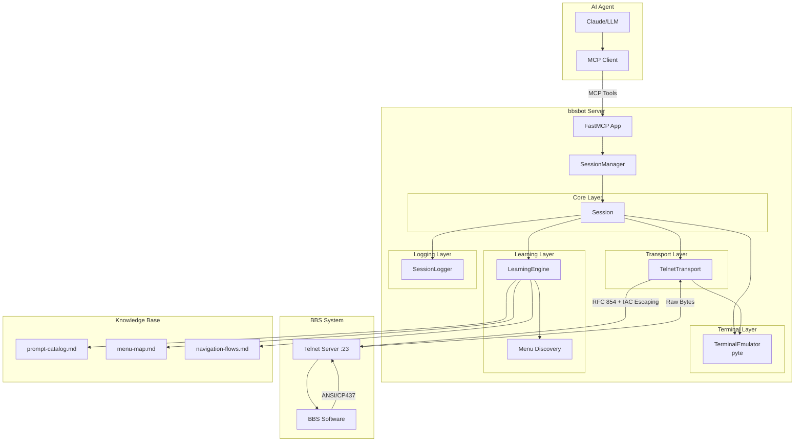
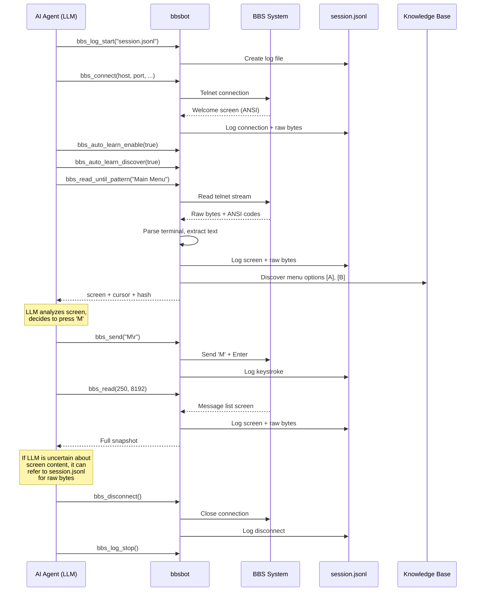

# bbsbot

FastMCP-based telnet client for BBS (Bulletin Board System) interactions with auto-learning capabilities. Enables AI agents to interact with legacy telnet-based systems through the Model Context Protocol (MCP).

> **⚠️ AI-Generated Code Disclaimer**
>
> This project was generated using AI assistance. While functional, it may contain bugs, security vulnerabilities, or unexpected behavior. Use at your own risk. The author assumes no responsibility or liability for any issues, damages, or losses resulting from the use of this software. Review the code thoroughly before using in any production environment.

## Overview

bbsbot bridges modern AI agents with vintage BBS systems by providing:
- Full terminal emulation with ANSI/CP437 support
- Pattern-based screen reading and navigation
- Automatic discovery and documentation of menus and prompts
- Session logging for analysis and replay
- MCP tool exposure for seamless AI integration

## Architecture

bbsbot uses a clean layered architecture with proper separation of concerns:



### Architecture Layers

- **Transport Layer** (`transport/`): Protocol abstraction (telnet with RFC 854 compliance, IAC byte escaping)
- **Terminal Layer** (`terminal/`): ANSI/CP437 terminal emulation using pyte
- **Core Layer** (`core/`): Session management with resource limits and state isolation
- **Learning Layer** (`learning/`): Auto-discovery of menus/prompts, knowledge base management
- **Logging Layer** (`logging/`): Structured JSONL session logging with raw bytes

## Features

- **Telnet Client**: Full RFC 854 telnet protocol with option negotiation (BINARY, SGA, NAWS, TTYPE)
- **Terminal Emulation**: Complete ANSI/CP437 terminal with 80x25 (configurable) screen buffer
- **Screen Reading**: Extract text, match patterns, wait for prompts with timeout control
- **Auto-Learning**: Discover menus `[A] Option`, prompts `Enter name:`, and document navigation flows
- **Session Logging**: JSONL format with timestamps, context, and raw bytes for replay/analysis
- **MCP Integration**: 25+ tools for connection, navigation, learning, and session management
- **Keepalive**: Configurable interval to prevent idle disconnections

## Installation

### Prerequisites

Install [uv](https://docs.astral.sh/uv/) (recommended package installer):

```bash
curl -LsSf https://astral.sh/uv/install.sh | sh
```

Or see [uv installation docs](https://docs.astral.sh/uv/getting-started/installation/) for other methods.

### Installing bbsbot

bbsbot is an MCP server that must be configured in your MCP client (Claude Desktop, Cline, etc.).

### Option 1: Install as a tool (recommended)

```bash
uv tool install bbsbot
```

Then add to your MCP client configuration:

```json
{
  "mcpServers": {
    "bbsbot": {
      "command": "bbsbot"
    }
  }
}
```

### Option 2: Install with pip

```bash
pip install bbsbot
```

Then configure your MCP client to run `bbsbot` as a server.

### Development Installation

```bash
git clone https://github.com/livingstaccato/bbsbot.git
cd bbsbot
uv pip install -e ".[dev]"
```

## Quick Start Example

Here's a complete example of an AI agent connecting to a BBS, navigating menus, and reading messages:

```python
from fastmcp import Client
from fastmcp.mcp_config import StdioMCPServer

# Start bbsbot server
server = StdioMCPServer(command="bbsbot", args=[])

async with Client(server.to_transport()) as client:
    # Connect to BBS
    await client.call_tool("bbs_connect", {
        "host": "bbs.example.com",
        "port": 23,
        "cols": 80,
        "rows": 25,
        "term": "ANSI",
        "send_newline": True
    })

    # Wait for main menu
    screen = await client.call_tool("bbs_read_until_pattern", {
        "pattern": r"\[M\] Main Menu",
        "timeout_ms": 5000
    })

    # Navigate to messages
    await client.call_tool("bbs_send", {"keys": "M\r"})

    # Read until message list appears
    screen = await client.call_tool("bbs_read_until_pattern", {
        "pattern": r"Message #\d+",
        "timeout_ms": 3000
    })

    print(screen["screen"])  # Display the screen

    # Disconnect
    await client.call_tool("bbs_disconnect", {})
```

## Usage

### As MCP Server

Run as an MCP server to expose BBS tools:

```bash
# Start the server (stdio transport)
bbsbot

# Or specify config
bbsbot --host localhost --port 2002
```

### Programmatic Usage

Direct Python API usage without MCP:

```python
from bbsbot.core.session_manager import SessionManager

manager = SessionManager(max_sessions=10)

# Connect and create session
session_id = await manager.create_session(
    host="bbs.example.com",
    port=23,
    cols=80,
    rows=25,
    term="ANSI",
    send_newline=True,
    reuse=False
)

# Get session
session = await manager.get_session(session_id)

# Read screen with timeout
snapshot = await session.read(timeout_ms=250, max_bytes=8192)

# Snapshot contains:
# - screen: formatted text (80x25)
# - screen_hash: SHA256 of screen text
# - cursor: {x, y} position
# - cols, rows, term

print(snapshot["screen"])
print(f"Cursor at: {snapshot['cursor']}")

# Send keys
await session.send("A\r\n")

# Wait for specific pattern (manual implementation)
import re
import asyncio

pattern = re.compile(r"Enter your name:")
timeout = 5.0
interval = 0.1
start_time = asyncio.get_event_loop().time()

matched = False
while asyncio.get_event_loop().time() - start_time < timeout:
    snapshot = await session.read(timeout_ms=int(interval * 1000), max_bytes=8192)
    if pattern.search(snapshot["screen"]):
        matched = True
        break
    await asyncio.sleep(interval)

if matched:
    print("Found prompt!")
    await session.send("Alice\r")

# Disconnect
await manager.close_session(session_id)
```

**Note:** For convenience, use the MCP tools which provide higher-level operations like `bbs_read_until_pattern`. The direct API is lower-level and requires manual pattern matching loops.

## MCP Tools Reference

The following tools are exposed when running as an MCP server:

**Note:** In v0.2.0, we removed duplicate `*_screen` variants and utility wrappers to simplify the API. Use `bbs_read()["screen"]` to extract screen text, and compose operations instead of using convenience wrappers like `bbs_expect` or `bbs_play_step`.

### Connection Management

#### `bbs_connect`
Connect to a BBS via telnet.
```json
{
  "host": "bbs.example.com",
  "port": 23,
  "cols": 80,
  "rows": 25,
  "term": "ANSI",
  "send_newline": true,
  "reuse": false
}
```

#### `bbs_disconnect`
Disconnect from the BBS. Always call before exit.
```json
{}
```

#### `bbs_status`
Get connection status, session ID, last RX/TX timestamps, keepalive info.
```json
{}
```

### Screen Interaction

#### `bbs_read`
**The primary read method.** Reads from telnet stream and returns full snapshot with screen text, raw output, cursor position, and hash. **Always logs raw bytes to JSONL** so LLM can refer back if uncertain about screen content.

Use `timeout_ms=0` to get current screen state without waiting for new data.

```json
{
  "timeout_ms": 250,
  "max_bytes": 8192
}
```
Returns:
```json
{
  "screen": "formatted 80x25 text...",
  "raw": "raw terminal output",
  "raw_bytes_b64": "base64 encoded raw bytes",
  "screen_hash": "sha256 of screen text",
  "cursor": {"x": 0, "y": 0},
  "cols": 80,
  "rows": 25,
  "term": "ANSI"
}
```

**Important:** Every `bbs_read` call logs the full snapshot including `raw_bytes_b64` to session.jsonl (if logging enabled). If the LLM misinterprets screen content, it can consult the log file for the exact raw bytes received.

#### `bbs_read_until_nonblank`
Keep reading until screen has non-whitespace content or timeout.
```json
{
  "timeout_ms": 5000,
  "interval_ms": 100,
  "max_bytes": 8192
}
```

#### `bbs_read_until_pattern`
Read until screen matches regex pattern.
```json
{
  "pattern": "Enter your name:",
  "timeout_ms": 5000,
  "interval_ms": 100,
  "max_bytes": 8192
}
```
Returns: snapshot with additional `"matched": true/false`

#### `bbs_send`
Send keystrokes to BBS (CP437 encoded).
```json
{
  "keys": "A\r\n"
}
```
Use `\r` for Enter, `\n` for Line Feed, `\x1b` for Escape.

#### `bbs_wake`
Try multiple keystroke sequences until screen changes (useful for idle timeouts).
```json
{
  "timeout_ms": 5000,
  "interval_ms": 250,
  "max_bytes": 8192,
  "keys_sequence": ["\r", " ", "\r\n"]
}
```

### Auto-Learning

#### `bbs_auto_learn_enable`
Enable/disable automatic learning of prompts and menus.
```json
{
  "enabled": true
}
```

#### `bbs_auto_learn_prompts`
Configure rules to auto-detect prompts.
```json
{
  "rules": [
    {
      "prompt_id": "username",
      "regex": "Enter your name:",
      "input_type": "text",
      "example_input": "Alice"
    }
  ]
}
```

#### `bbs_auto_learn_menus`
Configure rules to auto-detect menu options.
```json
{
  "rules": [
    {
      "menu_id": "main",
      "regex": "\\[M\\] Main Menu"
    }
  ]
}
```

#### `bbs_auto_learn_discover`
Enable automatic discovery of `[X]` style menu options.
```json
{
  "enabled": true
}
```

#### `bbs_learn_menu`
Manually document a menu.
```json
{
  "menu_id": "main",
  "title": "Main Menu",
  "options": [
    {"key": "M", "label": "Read Messages"},
    {"key": "P", "label": "Post Message"},
    {"key": "Q", "label": "Quit"}
  ],
  "prompt": "Your choice:"
}
```

#### `bbs_learn_prompt`
Manually document a prompt.
```json
{
  "prompt_id": "username",
  "pattern": "Enter your name:",
  "input_type": "text",
  "example_input": "Alice",
  "notes": "Username for login"
}
```

#### `bbs_learn_flow`
Document navigation between screens.
```json
{
  "from_screen": "main_menu",
  "action": "M",
  "to_screen": "message_list",
  "notes": "Press M to read messages"
}
```

### Session Management

#### `bbs_log_start`
Start JSONL session logging. **Highly recommended** - allows LLM to refer back to raw session data if it misreads the screen.
```json
{
  "path": "session.jsonl"
}
```

#### `bbs_log_stop`
Stop session logging.
```json
{}
```

#### `bbs_log_note`
Add structured note to log for debugging.
```json
{
  "note": "Starting message read loop",
  "context": "messages"
}
```

#### `bbs_set_context`
Set metadata attached to all subsequent log entries.
```json
{
  "context": {
    "menu": "main",
    "action": "reading_messages"
  }
}
```

### Keepalive

#### `bbs_keepalive`
Configure automatic keepalive to prevent idle timeout.
```json
{
  "interval_s": 30.0,
  "keys": "\r"
}
```
Set `interval_s` to `0` or `null` to disable.

## Typical Workflow



### Key Points

1. **Always start session logging** (`bbs_log_start`) - creates complete record with raw bytes
2. **Use `bbs_read` for everything** - single method that always logs raw data in JSONL
3. **Enable auto-learning** early - builds knowledge base for future sessions
4. **LLM can refer to logs if uncertain** - every `bbs_read` includes `raw_bytes_b64` in session log
5. **No separate "get screen" method** - use `bbs_read(timeout_ms=0)` to get current state
6. **Knowledge base accumulates** - menus, prompts, flows documented in `.bbs-knowledge/`

### Why Single Read Method?

Previously, there were separate methods for reading new data vs. getting current screen. This was confusing and error-prone. Now:
- **Single source of truth:** `bbs_read` always reads, always logs raw bytes
- **LLM safety:** If unsure about screen content, LLM can inspect `raw_bytes_b64` from session.jsonl
- **Consistent logging:** Every screen observation is recorded with full context
- **Simpler API:** No confusion about which method to use

## Configuration

### Knowledge Base

By default, learned knowledge is stored in platform-specific user data directories following the XDG Base Directory Specification:

- **Linux/BSD**: `~/.local/share/bbsbot` (or `$XDG_DATA_HOME/bbsbot`)
- **macOS**: `~/Library/Application Support/bbsbot`
- **Windows**: `%LOCALAPPDATA%\bbsbot`

Override the default location with:

```bash
export BBSBOT_KNOWLEDGE_ROOT=/path/to/knowledge
```

To keep knowledge bases per-project (instead of user-wide):

```bash
export BBSBOT_KNOWLEDGE_ROOT=$(pwd)/.bbs-knowledge
```

### Terminal Settings

Configure terminal size and keepalive via MCP tools:

```python
# Using MCP client
await client.call_tool("bbs_set_size", {"cols": 80, "rows": 25})
await client.call_tool("bbs_keepalive", {"interval_s": 30.0, "keys": "\r"})
```

Or programmatically:

```python
# Using SessionManager
session = await manager.get_session(session_id)
await session.set_size(cols=80, rows=25)
# Keepalive is configured per-session through the session manager
```

## Development

### Setup

```bash
uv pip install -e ".[dev]"
```

### Code Quality

This project uses modern Python 3.11+ features and strict quality tools:

- **Type Checking**: `mypy src/bbsbot`
- **Linting**: `ruff check src/bbsbot`
- **Formatting**: `ruff format src/bbsbot`
- **Testing**: `pytest`
- **Type Validation**: `ty src/bbsbot`

### Run All Checks

```bash
ruff check src/bbsbot
ruff format --check src/bbsbot
mypy src/bbsbot
pytest
```

### Regenerate Diagrams

The architecture and workflow diagrams are generated from Mermaid files using `mermaid-py`.

Generate SVG diagrams using make:

```bash
make diagrams
```

Available targets:
- `make diagrams` or `make diagrams-svg` - Generate SVG diagrams (default)
- `make diagrams-png` - Generate PNG diagrams
- `make clean` - Remove all generated diagram files
- `make help` - Show all available targets

Alternatively, run the script directly:

```bash
python3 docs/generate_diagrams.py --format svg
```

Source files:
- `docs/diagrams/architecture.mmd` → `architecture.svg`
- `docs/diagrams/workflow.mmd` → `workflow.svg`
- `docs/diagrams/session-flow.mmd` → `session-flow.svg`

## Intelligent Bot & Pattern Testing

bbsbot includes an intelligent bot system that uses prompt detection to autonomously navigate BBS games and test prompt patterns.

## TW2002 Trading Bot

Run the TW2002 trading bot:

```bash
bbsbot tw2002 bot -c tw2002_bot_config.yaml
```

### Goal Visualization (AI Strategy)

When `trading.strategy: ai_strategy` is active, goal progress is shown:

- A compact status line every `trading.ai_strategy.visualization_interval` turns
- A full timeline whenever the goal changes
- A summary report at the end of the session

To disable all goal visualization output:

```yaml
trading:
  ai_strategy:
    show_goal_visualization: false
```

### Spy / Watch Socket

You can broadcast the live terminal stream over TCP and attach to it from another terminal:

```bash
# Start bot with watch socket enabled (raw ANSI stream)
bbsbot tw2002 bot -c tw2002_bot_config.yaml --watch-socket

# Attach viewer
bbsbot spy
```

If you want structured JSON events (including goal visualization events), use JSON protocol:

```bash
# Start bot with JSON watch protocol
bbsbot tw2002 bot -c tw2002_bot_config.yaml --watch-socket --watch-socket-protocol json

# Attach and view JSON lines (the "viz" events include compact/timeline/summary text)
bbsbot spy --encoding utf-8
```

Goal visualization watch events look like:

```json
{"event":"viz","data":{"kind":"compact|timeline|summary","text":"...","turn":123,"character_name":"..."}}
```

### MCP “Spy” Tools (In-Process)

If you’re running the bot inside the MCP server process, you can query goal progress on demand:

- `tw2002_get_goal_visualization` (renders compact/timeline/summary)
- `tw2002_get_goal_phases` (raw phase data)
- `tw2002_capabilities` (returns grouped tool map + quick entrypoints)
- `tw2002_list_sessions` / `tw2002_set_active_session` (deterministic session targeting)
- `tw2002_bootstrap` (connect + login in one call)

### Quick Start

```bash
# Run intelligent bot with pattern testing
python play_tw2002_intelligent.py

# Run systematic pattern validation
python test_all_patterns.py
```

### Features

- **Reactive Detection**: Bot waits for prompts, detects them, and responds appropriately
- **Auto-Pagination**: Automatically handles "more" prompts and pagination
- **Pattern Validation**: Tests all 13 defined prompt patterns
- **Flow Tracking**: Records action→prompt sequences
- **Comprehensive Reports**: Generates JSON and Markdown results

### Architecture

The intelligent bot uses a **hybrid reactive approach**:

1. **Phase 1**: Pure reactive - detect prompts as they appear
2. **Phase 2**: Track prompt sequences and flows
3. **Phase 3**: Add prediction for common patterns (future)

See [.provide/INTELLIGENT-BOT-README.md](.provide/INTELLIGENT-BOT-README.md) for complete documentation.

### Example Bot Usage

```python
from play_tw2002_intelligent import IntelligentTW2002Bot

bot = IntelligentTW2002Bot()
await bot.connect()

# Navigate to game
await bot.navigate_twgs_to_game()
await bot.enter_game_as_player("BotName")

# Test commands with automatic prompt detection
await bot.test_command("D\r", "Display computer")
await bot.test_command("I\r", "Show inventory")

# Auto-handles pagination
snapshot = await bot.send_and_wait("L\r", "Long range scan")
snapshot = await bot.handle_pagination(snapshot)

# Generate results
await bot.generate_report()
```

### Pattern Testing

13 patterns tested:
- `login_username`, `login_password`
- `twgs_main_menu`, `twgs_select_game`
- `main_menu`, `command_prompt_generic`
- `sector_command`, `planet_command`
- `press_any_key`, `more_prompt`
- `yes_no_prompt`, `quit_confirm`
- `enter_number`

Results saved to `.provide/intelligent-bot-{timestamp}.json`

## Known Warnings

- You may see `UserWarning: Field name "validate" ... shadows an attribute` from Pydantic when starting `bbsbot`. This is currently harmless and does not affect runtime behavior.

## License

MIT License - Copyright (c) 2026 Tim Perkins

See [LICENSE](https://github.com/livingstaccato/bbsbot/blob/main/LICENSE) for details.
